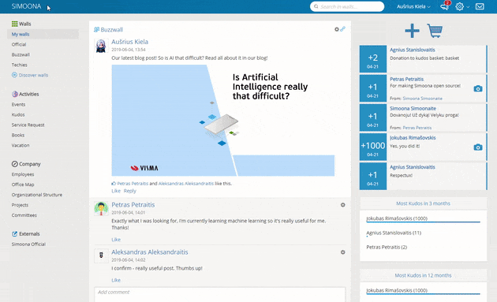

# Simoona

 

Simoona is smart and intuitive social intranet solution made for effective communication, empowerment, acknowledgement and social networking of your company employees.
Simoona encourages more interactions, more social activities, more fun. Focus on what's important and create the atmosphere of respect and acknowledgment.

## Simoona Features

  
Wall feature

  Only the option of speaking up and sharing what one cares about creates the atmosphere of freedom, equality and knowing that every employee matters and will be heard.
  
  Simoona Wall helps to understand what employees are thinking and care about. Give your people the ability to share their thoughts and participate in lively debates and discussions. Having a voice matters to engagement.
  
  Simoona Wall works as simple as any social media wall. Employees can write posts of any length, add pictures, videos links or gif images. Fellow employees can react to the conversation by liking it or adding a comment. Comment section allows users to add any kind of pictures, videos and links.

  

  
Employees feature

  Simoona employees (users) can be easily browsed in Employees list. It makes it really easy to find your job fellow and get more details how to contact him. Employee profile is also a part of Employees feature.
  
  

  
Kudos feature

  Social contribution needs to be quantified – that’s why Simoona has a built-in Kudos reward system. Every employee can assign certain points per good deed and demonstrate the recognition to the colleague.
  
  It’s a cornerstone of a social status (and thus a peer pressure): doing a right thing for a team not only is good, but it also tangible and clearly visible to everyone. Any organization can decide on its very own Kudos system design. Kudos employee reward system provides gamification dimension to organizational culture. The important thing is creating work culture provides recognition for social contributors and achievers.
  
  Kudos feature is fast and easy to use. User can pick any fellow employee and set the amount of donated Kudos, reasoning it by describing the good deed or work done by the Kudos recipient.

  

## Project Structure

Simoona consists of two main parts:

* Front-end webapp – purely AngularJS appication (no server-side code),
* Back-end app – ASP.NET MVC+WebApi project, with EntityFramework code-first database.

## Install from Binaries

The easiest way to install and try out Simoona is from pre-compiled binaries.
To do it, please follow [Install from binaries guidelines](LocalSetup.md).

## Install from Source Code

If you are planning to contribute or change Simoona code we suggest to follow [Installation from source code guidelines](build/README.md). Just head over there and follow the instructions.

## Developing and Contributing

If you are planning to do developing and contributing to Simoona code, please look into more detailed documentation about Simoona parts:

1. [Front-end webapp](Dev-WebApp.md)
    * Gulp Command List
    * Configuration
    * SSL Cerificate
    * Web Config

1. [Back-end app](Dev-API.md)
    * QuickStart
    * SMTP Client Setup
    * Configuration
    * Optional Features
